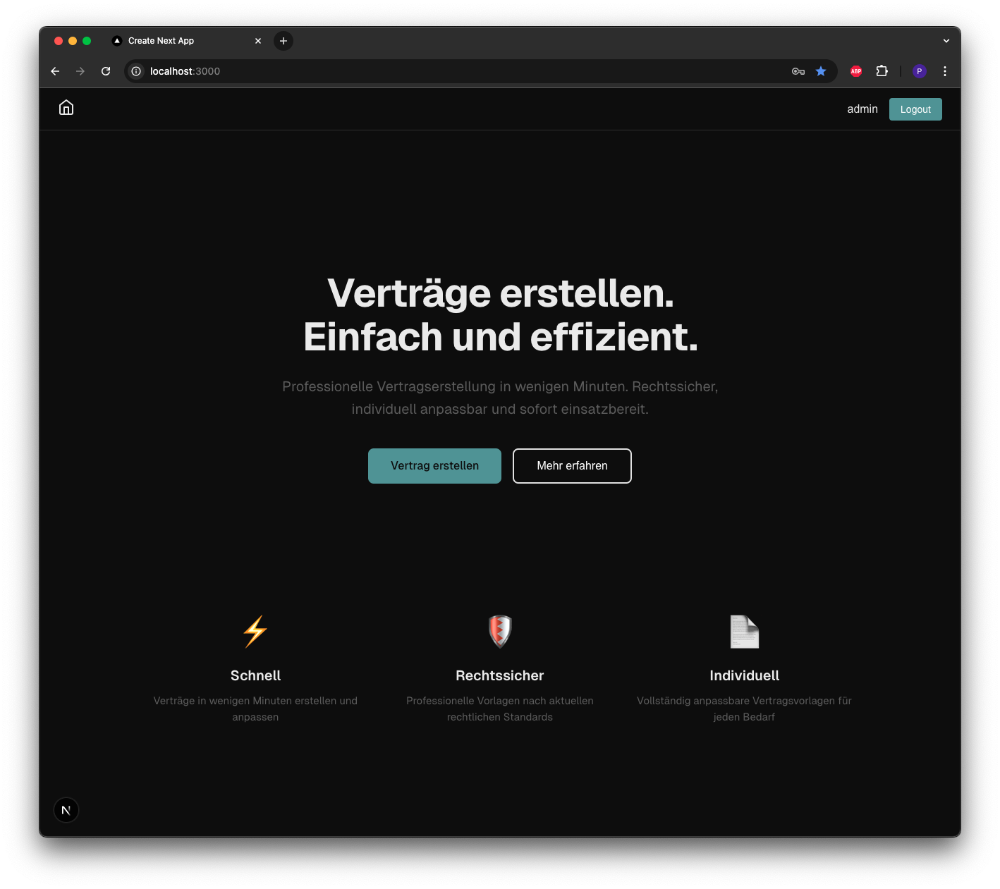
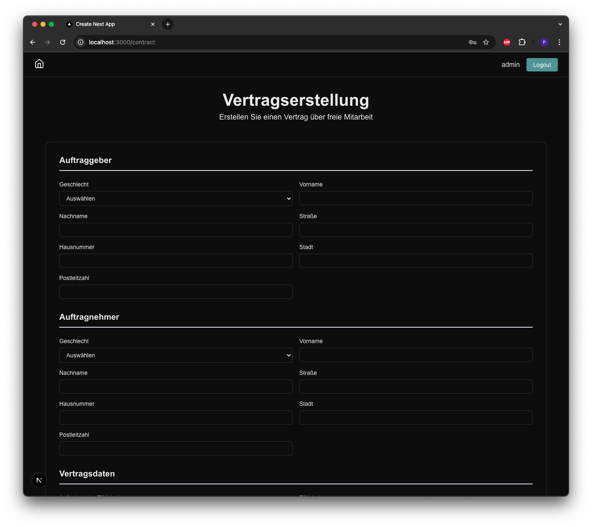
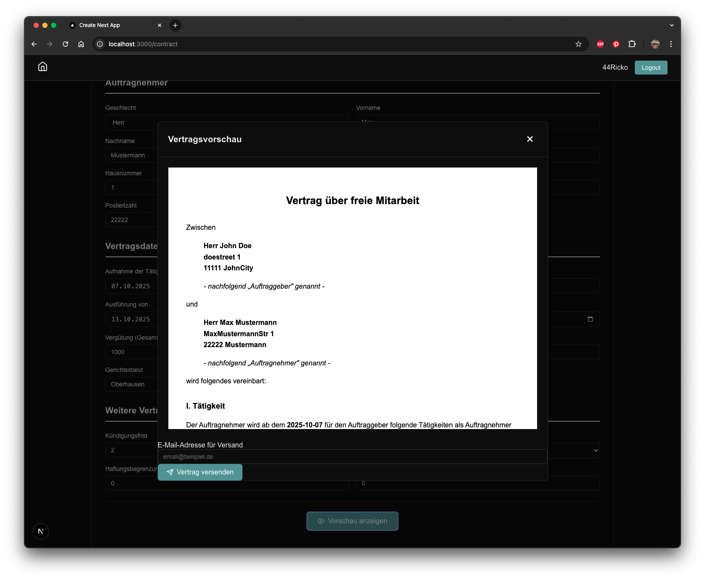
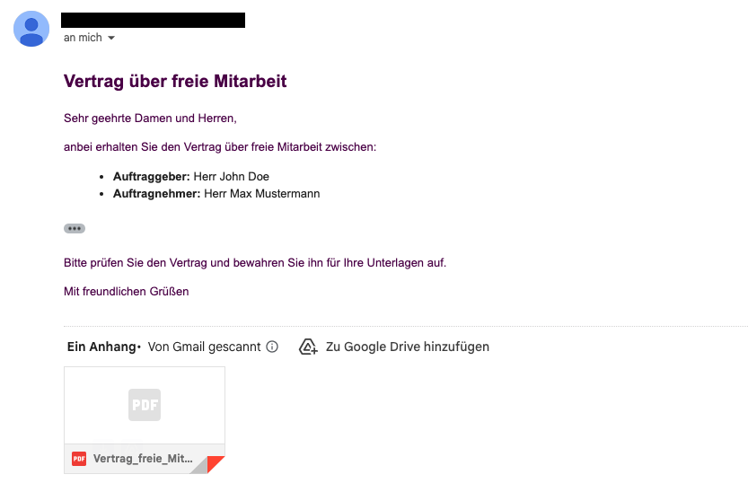
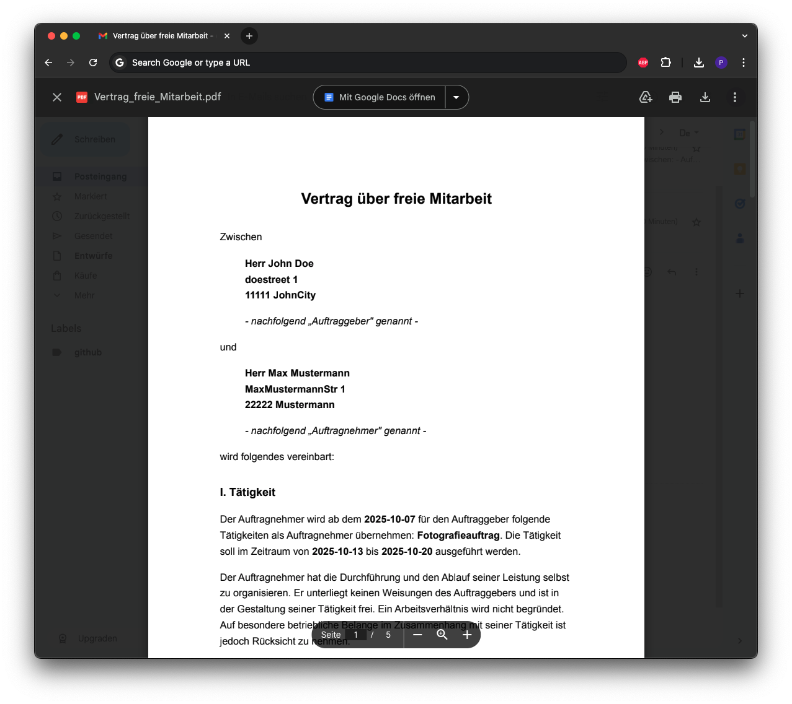
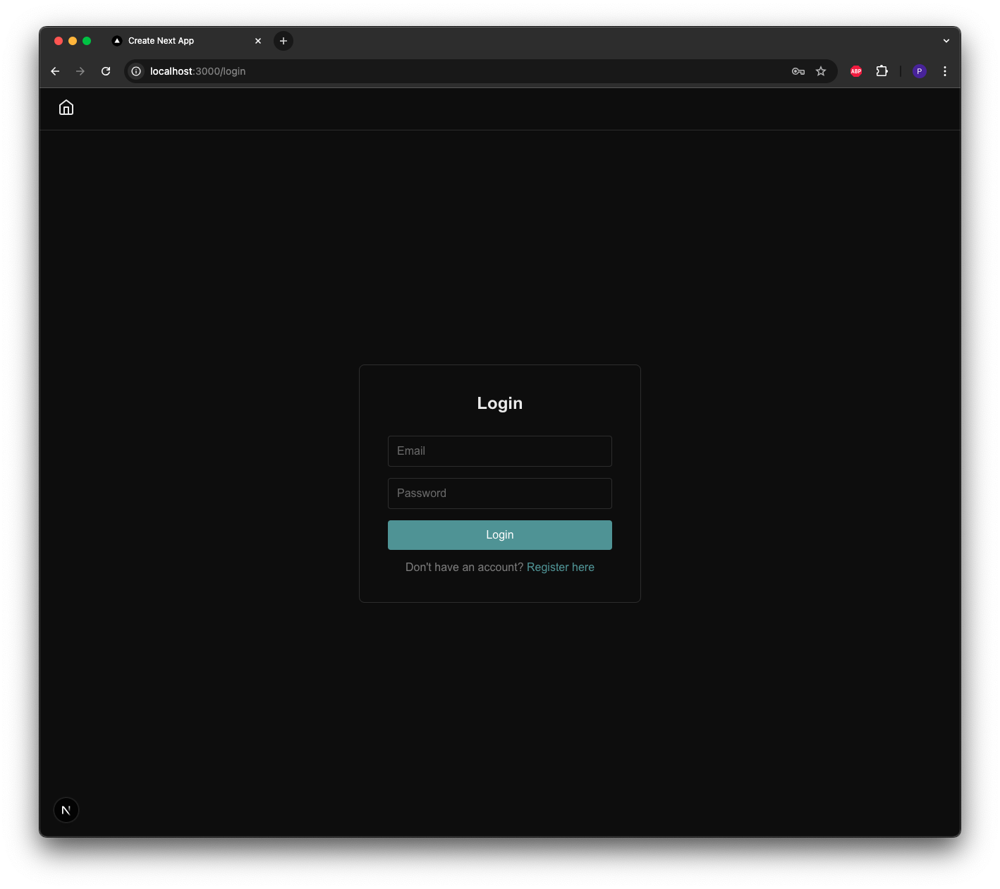
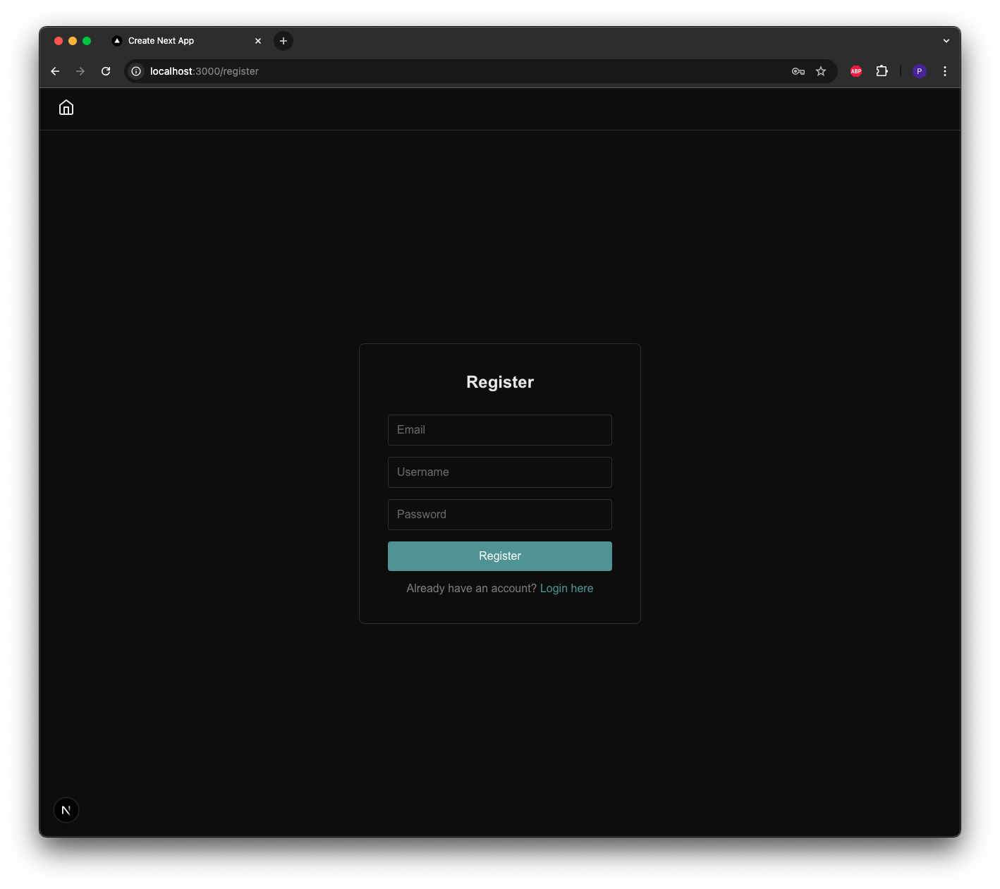

# Work in Progress: Nextjs Authentication Template + Freelance Contract Creator MVP
**MVP (Minimum Viable Product)** mit den wesentlichen Kernfunktionen einer Vertragserstellungs-App für Freelancer;
## Bilder

## Tech Stack
- Next.Js
- NextAuth
- bcrypt.js
- nodemailer
- sqlite3
- GoogleSMTP
- Puppeteer

## Lizenz
This code is provided for reference purposes only.  
No one is permitted to use, modify, distribute, or sell this software, whether for commercial or non-profit purposes.  
All rights reserved.

## Kontakt
qs.chitanta@gmail.com

